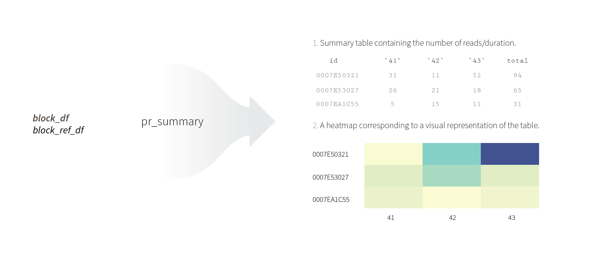
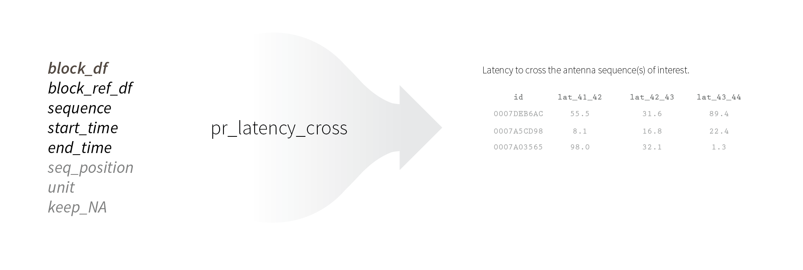

This package aims at providing an efficient workflow for extracting, formatting and analyzing data from RFID readers in the context of studying animal behaviour in experimental settings. A schematic version of this vignette is available in the *StalkeR cheat sheet*. The package allows researchers to compute several behavioural indices for each individual.

First, you can (install and) load the *StalkeR* package.

```{r setup}

library(pondr)

```

------------------------------------------------------------------------

# Format data

## Experimental blocks

Before starting to use the *StalkeR* package functions, you have to format and organise your data in a certain way. The unit of the *StalkeR* package is a data frame containing *reads* for one *experimental block*. This means that in the data frame, every row is one read, containing information about the individual ID, the antenna and the exact time of the read. An *experimental block* represents a unit limited in *space* and *time*, with associated antennas. For instance, if you work with birds, an experimental block can be one enclosure with several animals. If you work with fishes, an experimental block might be a pond/aquarium containing a group of fish. To obtain reads from one experimental block, we suggest to use the following workflow.

## Building a reference list per experimental block

First, you should build the a **experimental block *reference data frame* **. This object contains a list of all the individuals of one experimental block. In addition, several covariates can be added to the data frame, *e.g.* sex, size or experimental treatment. The data frame *must* contain at least the *id* columns with the individuals identification code/number.


```{r}

# I import the example data frame
data(block_ref_df)

# I show the first rows of this example
head(block_ref_df)


```

## Building your raw data frames

Then, depending on your experimental set-up, there are two options: (i) the data frame(s) you obtain from your RFID readers contain reads already corresponding to experimental blocks (one data frame per experimental block); (ii) the data frame(s) you obtain from your RFID readers contain reads from several experimental blocks (one data frame for several experimental block); several data frames obtained from your RFID readers constitute a single experimental block.

Eventually, you want to obtain one data frame per experimental block. Thus, if you are in the first case, you can move to the 'Format raw data' section below directly. If however you are in the second or the third case, you will need to subset of assemble the reads corresponding to your different experimental blocks first. We suggest the use of the *merge()* or the *rbind()* functions, for example.

### Format raw data

You must be now working with a data frame containing reads from one experimental block. This data frame has to contain at least four different columns: *id*, *date*, *time* and *antenna*. The *id* column must contain a unique number/code per individual; the *date* column must contain the data at the dd-mm-yy format; the *time* column must contain the time in the hh:mm:ss format; the *column* must contain a unique antenna number/code. Be sure to name these columns as in the example below, keeping in mind that R is case sensitive (no capital letters in columns name).

```{r}

# I import the example data frame
data(raw_df)

# I show the first rows of this example
head(raw_df)

```

Now that `block_ref_df` and `raw_df` are ready, you can start to use the different package functions.


---


# Clean the data (**pr_clean_data**)

The first function (**pr_clean_data**) has to be used before using any of the next *StalkeR* functions. It uses the `block_ref_df` and `raw_df` objects as inputs, and outputs a cleaner version of `raw_df` named `block_df`. The function does the following actions:

-   It keeps the columns of interest (*i.e.* id, antenna and time).
-   The time format is changed to *Posixt* format.
-   It keeps one read per individual at a certain antenna per second (*i.e.* remove repeats).
-   It removes ghost reads test reads, or any read that do not correspond to individuals present in the `block_ref_df` object.
-   It orders the data frame based on time.

The output `block_df`, is the working unit of this package.

{width="50%"}

*Example:*

```{r}

block_df <- pr_clean_data(raw_df = raw_df, 
              block_ref_df = block_ref_df)

head(block_df)


```

---

# Compute behavioural indices

Once you generated `block_df`, you can run a set of functions to compute different behavioural indices. The functions are described below:

## Data summary (**pr_summary**)

The **pr_summary** uses, as input, the reads from an experimental block (`block_df`) and a reference list of fish present in this block (`block_ref_df`). It produces:

-   A summary table containing the reads of each individual per antenna, and the total reads.
-   A heatmap corresponding to a visual representation of the table.


Why do we need both `block_df` and `block_ref_df`? If all the individuals have been read in `block_df`, then the individuals present in `block_ref_df` and `block_df` are the same. However, if some individuals haven't been read in `block_df` (e.g. animals haven't moved, lost the tag, are dead), then there will be more individuals in the `block_ref_df`.

{width="100%"}

*Example:*

```{r, fig.width=4, fig.height=5}
# I run the function
data_summary <- pr_summary(block_df = block_df, 
           block_ref_df = block_ref_df)

# I create the summary table object
summary_table <- data_summary$df
head(summary_table)

# I create a heatmap showing the number of reads per individual
summary_heatmap <- data_summary$heatmap
summary_heatmap


```


---

## Sociality index (**pr_sociality**)

The **pr_sociality** computes, for every individual, the proportion of time it was read in presence of at least one conspecific. To do so, the function divides the number of *accompanied reads* (number of reads for which the focal individual was read at the same second and at the same antenna than at least another individual) by the *total number of reads* (*accompanied* plus *non-accompanied* reads). 

**pr_sociality** uses three different inputs: `block_df`, `block_ref_df` and `cutoff`. The `cutoff` argument is a value corresponding to the minimum number of *total reads* from which the sociality index (that is, the proportion of accompanied reads) should be computed. For example, if an individual was read only once, by chance, in presence of a conspecific, a score of 100% for this individual is probably not representative of the real proportion of time it spends in presence of conspecifics. By default, the value if set at 10 total reads. For no cutoff, one can use a value of 0.

{width="100%"}

*Example:*
```{r}
sociality_table <- pr_sociality(block_df = block_df,
                                block_ref_df = block_ref_df,
                                cutoff = 15)

head(sociality_table)
```


---


## Latency to *reach* one or several antennas (**pr_latency_reach**)
This function computes, for every individual, the latency to reach (*i.e.* be read at) certain antennas. This can for example be used in the context of an exploration test, during which individuals enter an exploration box, in which they are read by an antenna.

The function computes the difference between the initial time (time at which the antennas were introduced/started to record) and the first read at one or several antennas of interest. Individuals that were not read at these antennas receive a score corresponding to the maximal possible duration by default.


In addition to `block_df` and `block_ref_df`, the function needs a series of additional arguments:


- `antenna_nb`: If there is one antenna of interest, then `antenna_nb` corresponds to its number/name. However, if there are several antennas of interest, the argument should be a vector of antenna names/numbers.

- `start_time`: The time from which the experimental block starts (*i.e. POSIXct* format, see examples).

- `end_time`: The time until which the experimental block lasts (*i.e. POSIXct* format, see examples).

- `keep_NA`: Logical argument. If the individuals are never read by the antenna(s), the latency might be set as the maximal possible value, *i.e.* `end_time` - `start_time` (default option), or be kept as NA.

- `unit`: Unit of the latency duration: 'm' as default.


{width="100%"}


*Example 1, one antenna of interest:*
```{r}
# Antenna of interest
antenna_nb_1 <- 44

# Start and end time
start_time <-
  as.POSIXct(strptime(c("2020-11-05 12:30:00"), "%Y-%m-%d %H:%M:%OS"), "UTC")
end_time <-
  as.POSIXct(strptime(c("2020-11-05 15:00:00"), "%Y-%m-%d %H:%M:%OS"), "UTC")

# I run the function
ant_44_table <- pr_latency_reach(
block_df = block_df,
block_ref_df = block_ref_df,
antenna_nb_1,
start_time = start_time,
end_time = end_time,
keep_NA = T,
unit = 's')

head(ant_44_table)

```

*Example 2, several antenna of interest:*
```{r}
# Antennas of interest
antenna_nb_2 <- c(41, 42, 43, 44)

# I run my function
mult_ant_table <- pr_latency_reach(
block_df = block_df,
block_ref_df = block_ref_df,
antenna_nb_2,
start_time = start_time,
end_time = end_time,
unit = 'm')

head(mult_ant_table)
```


---


## Latency to *cross* one or several sequences of antennas (**pr_latency_cross**)

I will need to be awake to write this one actually.


{width="100%"}


---

Same here.


{width="100%"}


